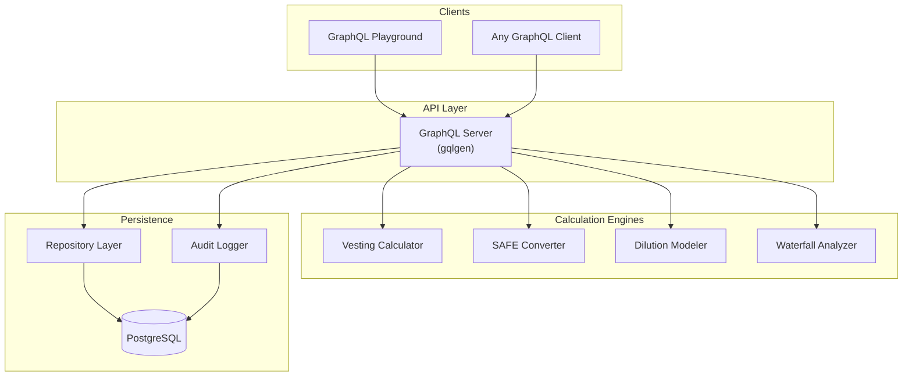

# vestigo

A cap table calculation engine in Go. Covers the core math behind equity management: vesting schedules, SAFE conversion, dilution modeling, and liquidation waterfall analysis.

Built as a portfolio project for the [Senior Backend Engineer](https://job-boards.greenhouse.io/pulley) role at [Pulley](https://pulley.com), using Go, PostgreSQL, and GraphQL.

> **vestigo**: *vesting* + *Go*

---

## What It Does

Four calculation engines exposed through a GraphQL API:

| Engine | Description |
|--------|------------|
| **Vesting** | Vested/unvested shares at any date. Cliff, monthly/quarterly/annual frequency, single-trigger acceleration. |
| **SAFE Conversion** | Converts pre-money and post-money SAFEs into shares at a priced round, resolving valuation caps and discount rates. |
| **Dilution Modeling** | Pro forma cap table showing ownership impact of a hypothetical funding round. |
| **Waterfall Analysis** | Per-stakeholder exit payouts respecting liquidation preferences, seniority, and participation. |

---

## Architecture



Notable choices:

- **Pure calculation engines.** No database access, no side effects. Inputs in, results out. Easy to test, easy to reuse.
- **Repository pattern.** Store layer implements domain interfaces, keeping business logic decoupled from PostgreSQL.
- **Append-only audit log.** Every mutation records before/after state as JSONB. Non-blocking so audit failures don't break writes.
- **Decimal arithmetic everywhere.** All monetary values and share counts use `shopspring/decimal`. No floating point.

---

## Tech Stack

| Component | Technology |
|-----------|-----------|
| Language | Go 1.24 |
| Database | PostgreSQL 16 |
| API | GraphQL via [gqlgen](https://github.com/99designs/gqlgen) |
| Migrations | golang-migrate |
| Testing | testcontainers-go (real PostgreSQL per test) |
| Local dev | Docker Compose |

---

## Quick Start

### Prerequisites

- Docker and Docker Compose
- Go 1.24+ (for running tests locally)

### Run the Server

```bash
docker compose up --build
```

Starts PostgreSQL, runs migrations, and launches the GraphQL server. Playground at [http://localhost:8080](http://localhost:8080).

### Run Tests

```bash
# Unit tests (no Docker required)
go test ./internal/engine/... -v

# Full suite including integration tests (requires Docker)
go test ./... -v -timeout 120s
```

---

## Example Queries

### Set Up a Company

```graphql
mutation {
  createCompany(input: { name: "Acme Inc" }) {
    id
    name
  }
}

mutation {
  createShareClass(input: {
    companyID: "<company-id>"
    name: "Common"
    isPreferred: false
    authorizedShares: "10000000"
  }) { id }
}

mutation {
  createVestingSchedule(input: {
    cliffMonths: 12
    totalMonths: 48
    frequency: MONTHLY
  }) { id }
}

mutation {
  addStakeholder(input: {
    companyID: "<company-id>"
    name: "Alice Chen"
    email: "alice@acme.com"
    role: FOUNDER
  }) { id }
}

mutation {
  issueGrant(input: {
    companyID: "<company-id>"
    stakeholderID: "<stakeholder-id>"
    shareClassID: "<share-class-id>"
    vestingScheduleID: "<vesting-schedule-id>"
    quantity: "4800000"
    grantDate: "2024-01-01"
  }) { id quantity }
}
```

### Check Vesting Status

```graphql
query {
  vestingStatus(grantID: "<grant-id>", asOfDate: "2025-06-15") {
    totalShares
    vestedShares
    unvestedShares
    percentVested
    cliffDate
    fullyVestedAt
    isFullyVested
  }
}
```

### Model a Funding Round

```graphql
query {
  modelDilution(input: {
    companyID: "<company-id>"
    roundName: "Series A"
    preMoneyValuation: "20000000"
    amountRaised: "5000000"
    newShareClass: "Series A Preferred"
    investorName: "Sequoia Capital"
  }) {
    roundName
    preRound { totalShares entries { stakeholderName shares ownershipPct } }
    postRound { totalShares entries { stakeholderName shares ownershipPct } }
    newInvestor { stakeholderName shares ownershipPct }
  }
}
```

### Run a Liquidation Waterfall

```graphql
query {
  waterfall(companyID: "<company-id>", exitValuation: "50000000") {
    exitValuation
    totalPayout
    payouts {
      stakeholderName
      shareClassName
      payout
      payoutPerShare
    }
  }
}
```

---

## Project Structure

```
vestigo/
├── cmd/server/              Server entrypoint
├── internal/
│   ├── domain/              Core types and repository interfaces
│   ├── engine/
│   │   ├── vesting/         Vesting calculation + tests
│   │   ├── safe/            SAFE conversion + tests
│   │   ├── dilution/        Dilution modeling + tests
│   │   └── waterfall/       Waterfall analysis + tests
│   ├── graph/               GraphQL schema, generated code, resolvers
│   ├── store/               PostgreSQL repositories + integration tests
│   └── audit/               Audit logging
├── migrations/              SQL migration files
├── docker-compose.yml
├── Dockerfile
└── Makefile
```

---

## Design Decisions

**GraphQL over REST?** Pulley uses Hasura/GraphQL. I used gqlgen to hand-roll the API rather than auto-generate it, since the interesting part is integrating calculation logic behind resolvers, not configuring a tool.

**`shopspring/decimal` over `float64`?** `float64` can't exactly represent `0.1`. In financial calculations, rounding errors compound. Decimal arithmetic with explicit rounding is the only option.

**Engines separated from the store?** The engines are pure functions. They don't touch the database. This makes them independently testable, reusable outside the API, and easy to reason about.

**testcontainers over mocks?** Mocking `*sql.DB` tests whether your code calls the mock correctly, not whether your SQL works. Integration tests against real PostgreSQL catch constraint violations, type mismatches, and migration issues that mocks never will.

**Audit logging?** Every mutation in a fintech system should be traceable. The audit log captures entity, action, and before/after state as JSONB. In production this would include actor identity via auth middleware.

---

## Known Limitations

These are deliberate scope decisions for a portfolio project, not oversights.

| Limitation | Notes |
|------------|-------|
| No dataloaders | Batch-fetch methods resolve the worst N+1 cases, but deeply nested GraphQL queries could still produce redundant fetches. A production system would add [dataloaden](https://github.com/vektah/dataloaden) or equivalent. |
| No auth / single-tenant | No authentication, authorization, or row-level security. A production cap table system requires RBAC and tenant isolation at the query layer. |
| No frontend | Backend project. The GraphQL playground is the interface. |
| No CI/CD | Straightforward to add with GitHub Actions. Not the point of the project. |
| No multi-tenancy | Would require tenant-scoped queries and RLS policies. |

---

## Domain Glossary

- **Cap Table** — Record of who owns what in a company: shares, options, SAFEs, warrants, by stakeholder and share class.
- **Vesting Schedule** — Timeline over which granted shares become earned. Typical: 4-year schedule with 1-year cliff.
- **SAFE** — Simple Agreement for Future Equity. Investor pays now, gets shares later at a price set by a future priced round. Pre-money and post-money SAFEs differ in how the valuation cap applies.
- **Dilution** — When new shares are issued, existing ownership percentages shrink even though share counts don't change.
- **Liquidation Waterfall** — Rules for distributing exit proceeds. Preferred shareholders typically get paid first via liquidation preferences before common shareholders receive anything.

---

## License

MIT
